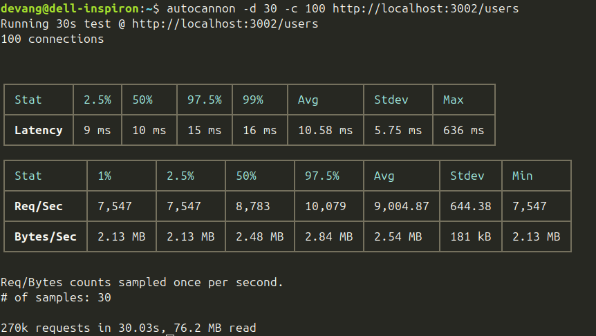
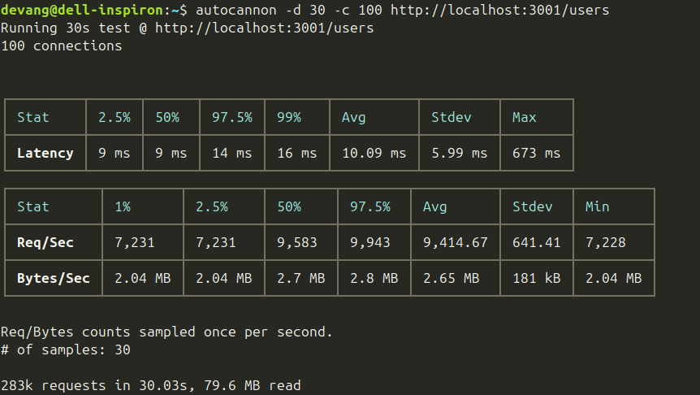
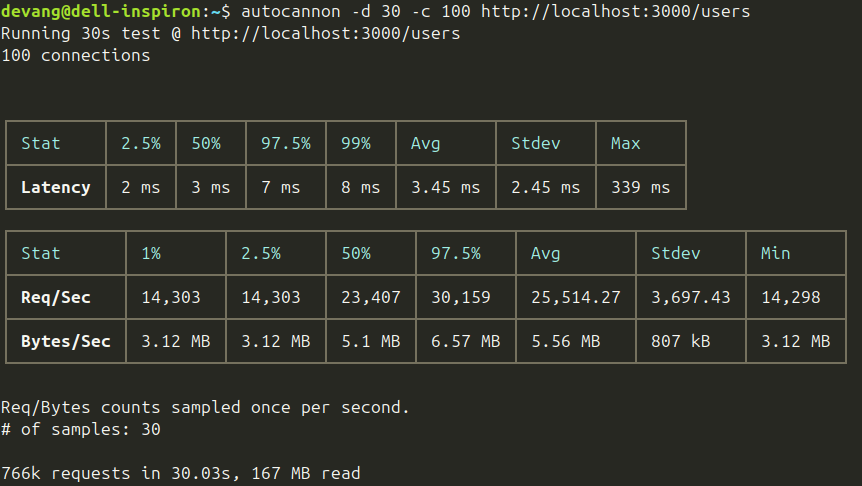

When building high-performance APIs in Node.js, developers often turn to frameworks like **Express**, **NestJS**, and **Fastify**. But which one truly performs best under load?

In this blog, I’ll walk you through a simple benchmark comparing these three frameworks under the same load conditions using **Autocannon**, a powerful HTTP benchmarking tool.

---

## **🛠 Test Setup**

To ensure a fair comparison, I created the same basic API endpoint (`GET /`) in all three frameworks. Each endpoint simply returned a small JSON response like 

```JSON
[
    { "id": 1, "name": "Alice" },
    { "id": 2, "name": "Bob" }
]
```

### **Environment:**

* **Machine**: \[8-core CPU, 16GB RAM\]

* **Node.js Version**: v20.18.1

* **Benchmarking Tool**: [`autocannon`](https://github.com/mcollina/autocannon)

**Test Command**:

Start all server with following commands in different terminals and then run autocannon command in fourth terminal for load testing one by one 

```sh
# Start express server on 3002
cd express
npm install
npm run dev

# Start nest server on 3001
cd nestjs
npm install
npm run start:dev

# Start fastify server on 3000
cd fastify
npm install
npm run dev
```

```sh
# Express.js
autocannon -d 30 -c 100 http://localhost:3002/users

# NestJS
autocannon -d 30 -c 100 http://localhost:3001/users

# Fastify
autocannon -d 30 -c 100 http://localhost:3000/users

```


* 100 concurrent users  
* 30-second test duration

## 

## **🧪 Benchmark Results**

Here are the results from the Autocannon tests:

| Framework | Total Requests | Data Read | Avg Response Time |
| ----- | ----- | ----- | ----- |
| **Express** | 270,000 | 76.2 MB | 10.58 ms |
| **NestJS** | 283,000 | 79.6 MB | 10.09 ms |
| **Fastify** | **766,000** | **167 MB** | **3.45 ms** |

### **Express**



### **NestJS**



### **Fastify**



---

## **🧩 Code Snippets**

Each server was kept as minimal as possible. Here's what the basic route looked like in each:

### **Express**

```ts
import { Request, Response } from 'express';

export const getUsers = (req: Request, res: Response) => {
  res.json([
    { id: 1, name: 'Alice' },
    { id: 2, name: 'Bob' }
  ]);
};
```

### **NestJS**
```ts
@Controller('users')
export class AppController {
  constructor(private readonly appService: AppService) {}

  @Get()
  getUsers() {
    return [
      { id: 1, name: 'Alice' },
      { id: 2, name: 'Bob' }
    ];
  }
}
```
### 

### **Fastify**

```ts
export const getUsers = async (req: FastifyRequest, reply: FastifyReply) => {
  reply.send([
    { id: 1, name: 'Alice' },
    { id: 2, name: 'Bob' }
  ]);
};
```

---

## **📊 Analysis**

Fastify **blew the competition away** with more than **2.7x the requests** compared to Express and NestJS. Why?

* **Fastify**: Built from the ground up for speed with a focus on low overhead and optimized serialization.

* **NestJS**: A robust framework built on top of Express (or Fastify), with added abstraction layers like decorators and dependency injection, which slightly impacts performance.

* **Express**: Still a solid choice, but not optimized for extreme throughput or modern JS performance patterns.

---

## **✅ Conclusion**

Here’s the quick takeaway:

* ✅ **Use Fastify** when raw performance is critical.

* ✅ **Use NestJS** for large, maintainable applications with a solid structure.

* ✅ **Use Express** for simple apps or when rapid prototyping is key.

Fastify clearly wins the performance race, but all three have their place in the modern Node.js ecosystem.


---

## **💬 What do you use?**

Which framework do you prefer and why? Have you faced any performance bottlenecks? Let’s talk in the comments\!